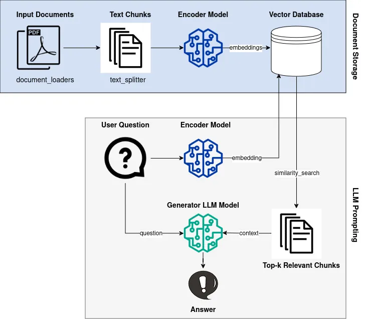
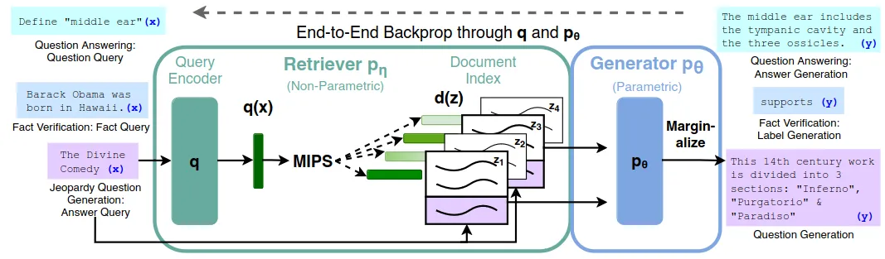
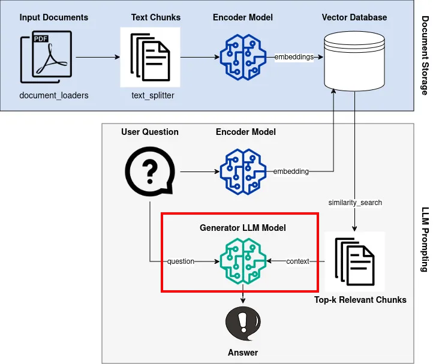
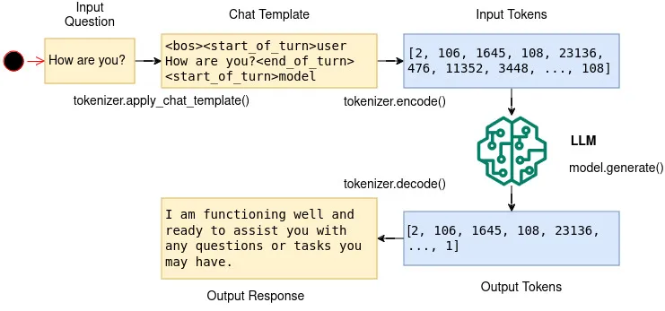
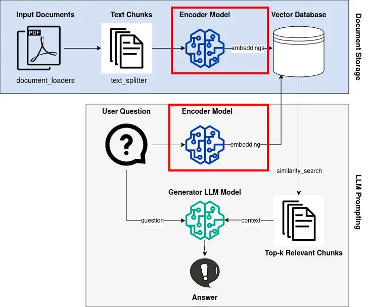
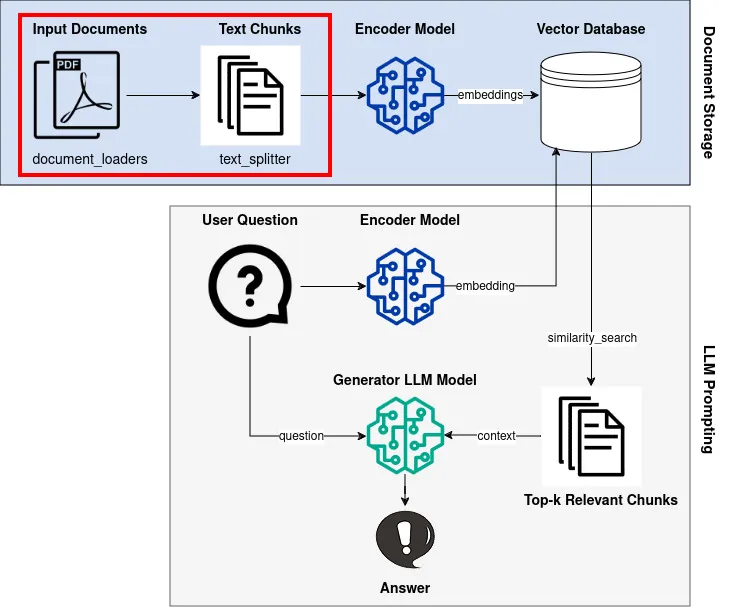
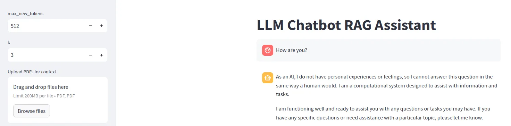

# Intro

## Rag Pipeline



## What is Retrieval-Augmented Generation (RAG)



## 生成组件: LLM Model



```python
!pip install torch transformers bitsandbytes accelerate
import os
import torch
from transformers import AutoTokenizer, AutoModelForCausalLM, BitsAndBytesConfig
from dotenv import load_dotenv
load_dotenv()

ACCESS_TOKEN = os.getenv("ACCESS_TOKEN")

model_id = "google/gemma-2b-it"
tokenizer = AutoTokenizer.from_pretrained(model_id, token=ACCESS_TOKEN)
quantization_config = BitsAndBytesConfig(load_in_4bit=True, 
                                         bnb_4bit_compute_dtype=torch.bfloat16)

model = AutoModelForCausalLM.from_pretrained(model_id, 
                                             device_map="auto", 
                                             quantization_config=quantization_config,
                                             token=ACCESS_TOKEN)
model.eval()
device = 'cuda' if torch.cuda.is_available() else 'cpu'1
```

```python
def generate(question: str, context: str):
    if context == None or context == "":
        prompt = f"""Give a detailed answer to the following question. Question: {question}"""
    else:
        prompt = f"""Using the information contained in the context, give a detailed answer to the question.
            Context: {context}.
            Question: {question}"""
    chat = [{"role": "user", "content": prompt}]
    formatted_prompt = tokenizer.apply_chat_template(
        chat,
        tokenize=False,
        add_generation_prompt=True,
    )
    inputs = tokenizer.encode(
        formatted_prompt, add_special_tokens=False, return_tensors="pt"
    ).to(device)
    with torch.no_grad():
        outputs = model.generate(
            input_ids=inputs,
            max_new_tokens=250,
            do_sample=False,
        )
    response = tokenizer.decode(outputs[0], skip_special_tokens=False)
    response = response[len(formatted_prompt) :]  # remove input prompt from reponse
    response = response.replace("<eos>", "")  # remove eos token
    return response
```



```bash
<bos><start_of_turn>user
How are you?<end_of_turn>
<start_of_turn>model
```

```python
print(generate(question="How are you?", context=""))
>> As an AI, I do not have personal experiences or feelings, so I cannot answer this question in the same way a human would. I am a computational system designed to assist with information and tasks.
>> 
>> I am functioning well and ready to assist you with any questions or tasks you may have. If you have any specific questions or need assistance with a particular topic, please let me know.
```

## 召回组件: Encoder Model + Similarity Search



```python
from langchain_community.embeddings import (
    HuggingFaceEmbeddings
)

encoder = HuggingFaceEmbeddings(
    model_name = 'sentence-transformers/all-MiniLM-L12-v2', 
    model_kwargs = {'device': "cpu"}
)
```

```python
embeddings = encoder.embed_query("How are you?")
```

```python
print(embeddings)
>> [-0.03747698292136192, -0.02319679595530033, ..., -0.07512704282999039]

print(len(embeddings))
>> 384
```

```python
import numpy as np

q = encoder.embed_query("What is an apple?")
z1 = encoder.embed_query(
    "An apple is a round, edible fruit produced by an apple tree (Malus spp., among them the domestic or orchard apple; Malus domestica)."
)  # from wikipedia
z2 = encoder.embed_query(
    "The cat (Felis catus), commonly referred to as the domestic cat or house cat, is the only domesticated species in the family Felidae."
)  # from wikipedia

print(np.dot(q, z1) / (np.linalg.norm(q) * np.linalg.norm(z1)))
>> 0.7321886823078861

print(np.dot(q, z2) / (np.linalg.norm(q) * np.linalg.norm(z2)))
>> 0.15372599165329065

```

## 文档加载器和文本分割器


```python
!pip install pypdf tiktoken langchain sentence-transformers
from langchain_community.document_loaders import PyPDFLoader
from langchain.text_splitter import RecursiveCharacterTextSplitter

loaders = [
    PyPDFLoader("/path/to/pdf/file1.pdf"),
    PyPDFLoader("/path/to/pdf/file2.pdf"),
]
pages = []
for loader in loaders:
    pages.extend(loader.load())

text_splitter = RecursiveCharacterTextSplitter.from_huggingface_tokenizer(
    tokenizer=AutoTokenizer.from_pretrained(
        "sentence-transformers/all-MiniLM-L12-v2"
     ),
     chunk_size=256,
     chunk_overlap=32,
     strip_whitespace=True,
)

docs = text_splitter.split_documents(pages)
```

```python
text = "Lorem ipsum dolor sit amet, consectetur adipiscing elit."

chunk_size=1
chunk_overlap=0
print(text_splitter.split_text(text))
>> ['L', 'o', 'r', 'e', 'm', ' ', 'i', 'p', 's', 'u', 'm', ' ', 'd', 'o', 'l', 'o', 'r', ' ', 's', 'i', 't', ' ', 'a', 'm', 'e', 't', ',', ' ', 'c', 'o', 'n', 's', 'e', 'c', 't', 'e', 't', 'u', 'r', ' ', 'a', 'd', 'i', 'p', 'i', 's', 'c', 'i', 'n', 'g', ' ', 'e', 'l', 'i', 't', '.']

chunk_size=10
chunk_overlap=0
print(text_splitter.split_text(text))
>> ['Lorem ipsum', 'dolor sit', 'amet,', 'consectetur', 'adipiscing', 'elit.']

chunk_size=50
chunk_overlap=0
print(text_splitter.split_text(text))
>> ['Lorem ipsum dolor sit amet, consectetur adipiscing', 'elit.']

chunk_size=20
chunk_overlap=10
print(text_splitter.split_text(text))
>> ['Lorem ipsum dolor', 'ipsum dolor sit', 'dolor sit amet,', 'sit amet, consectetur', 'consectetur adipiscing', 'adipiscing elit.']
```

## 向量数据库


```python
!pip install faiss-cpu

from langchain.vectorstores import FAISS
from langchain_community.vectorstores.utils import DistanceStrategy

faiss_db = FAISS.from_documents(
    docs, encoder, distance_strategy=DistanceStrategy.COSINE
)
```

```python
retrieved_docs = faiss_db.similarity_search("My question", k=5)
```

## 基于Streamlit的用户界面



```python
!pip install streamlit
import os
import streamlit as st
from model import ChatModel
import rag_util


FILES_DIR = os.path.normpath(
    os.path.join(os.path.dirname(os.path.abspath(__file__)), "..", "files")
)


st.title("LLM Chatbot RAG Assistant")


@st.cache_resource
def load_model():
    model = ChatModel(model_id="google/gemma-2b-it", device="cuda")
    return model


@st.cache_resource
def load_encoder():
    encoder = rag_util.Encoder(
        model_name="sentence-transformers/all-MiniLM-L12-v2", device="cpu"
    )
    return encoder


model = load_model()  
encoder = load_encoder() 

def save_file(uploaded_file):
    """helper function to save documents to disk"""
    file_path = os.path.join(FILES_DIR, uploaded_file.name)
    with open(file_path, "wb") as f:
        f.write(uploaded_file.getbuffer())
    return file_path
```

```python
with st.sidebar:
    max_new_tokens = st.number_input("max_new_tokens", 128, 4096, 512)
    k = st.number_input("k", 1, 10, 3)
    uploaded_files = st.file_uploader(
        "Upload PDFs for context", type=["PDF", "pdf"], accept_multiple_files=True
    )
    file_paths = []
    for uploaded_file in uploaded_files:
        file_paths.append(save_file(uploaded_file))
    if uploaded_files != []:
        docs = rag_util.load_and_split_pdfs(file_paths)
        DB = rag_util.FaissDb(docs=docs, embedding_function=encoder.embedding_function)

if "messages" not in st.session_state:
    st.session_state.messages = []

for message in st.session_state.messages:
    with st.chat_message(message["role"]):
        st.markdown(message["content"])

if prompt := st.chat_input("Ask me anything!"):
    st.session_state.messages.append({"role": "user", "content": prompt})
    with st.chat_message("user"):
        st.markdown(prompt)

    with st.chat_message("assistant"):
        user_prompt = st.session_state.messages[-1]["content"]
        context = (
            None if uploaded_files == [] else DB.similarity_search(user_prompt, k=k)
        )
        answer = model.generate(
            user_prompt, context=context, max_new_tokens=max_new_tokens
        )
        response = st.write(answer)
    st.session_state.messages.append({"role": "assistant", "content": answer})
```